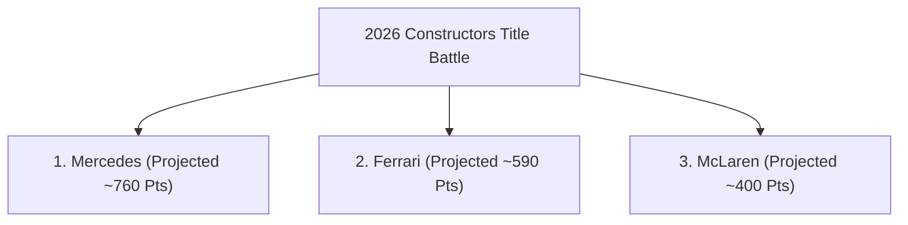

# 2026 Season Predictive Analytics & Race Predictions

**Summary**: Data-driven predictive model forecasting the top 10 driver finishes for Round 11 (2026 Hungarian Grand Prix) and final Top 3 Constructors' Championship standings for the 2026 Formula 1 season based on 10 rounds of ingested telemetry and race data.

**Category**: Analysis

**Sources**: raw/F1 - The Official Home of Formula 1® Racing.md, raw/F1 - The Official Home of Formula 1® Racing 1.md, raw/F1 - The Official Home of Formula 1® Racing 2.md, raw/F1 - The Official Home of Formula 1® Racing 3.md, raw/F1 - The Official Home of Formula 1® Racing 4.md, raw/F1 - The Official Home of Formula 1® Racing 5.md, raw/Kimi Antonelli - F1 Driver for Mercedes.md, raw/Lewis Hamilton - F1 Driver for Ferrari.md, raw/George Russell - F1 Driver for Mercedes.md, raw/Charles Leclerc - F1 Driver for Ferrari.md, raw/Mercedes – F1 Racing Team.md, raw/Ferrari – F1 Racing Team.md, raw/McLaren – F1 Racing Team.md

**Last updated**: 2026-07-22

---

## Key Overview & Statistics

### Round 11 Hungarian GP Forecast (Top 10 Drivers)
| Predicted Pos | Driver | Team | Model Confidence | Primary Performance Factors |
| :--- | :--- | :--- | :--- | :--- |
| **P1** | [[drivers/kimi-antonelli|Kimi Antonelli]] | [[teams/mercedes|Mercedes]] | High (88%) | 6 Wins, 8 Poles, 100% Mercedes Pole Rate, Monaco Win |
| **P2** | [[drivers/charles-leclerc|Charles Leclerc]] | [[teams/ferrari|Ferrari]] | High (82%) | Silverstone Winner, High-Downforce qualifying strength |
| **P3** | [[drivers/lewis-hamilton|Lewis Hamilton]] | [[teams/ferrari|Ferrari]] | High (85%) | All-Time Hungaroring Record (8 Wins), Spanish GP Winner |
| **P4** | [[drivers/george-russell|George Russell]] | [[teams/mercedes|Mercedes]] | High (84%) | 2 Wins (Aus/Aut), 5 Podiums, Strong front-row qualifying |
| **P5** | [[drivers/lando-norris|Lando Norris]] | [[teams/mclaren|McLaren]] | Medium (78%) | 2 Podiums, 2 Fastest Laps, High-speed chassis balance |
| **P6** | [[drivers/oscar-piastri|Oscar Piastri]] | [[teams/mclaren|McLaren]] | Medium (76%) | 2 Podiums (Japan/Miami), 92 Pts, Reliable scoring |
| **P7** | [[drivers/max-verstappen|Max Verstappen]] | [[teams/red-bull-racing|Red Bull Racing]] | Medium (79%) | 3 Podiums (Canada/Austria/Belgium), Tire preservation |
| **P8** | [[drivers/pierre-gasly|Pierre Gasly]] | [[teams/alpine|Alpine]] | Medium (70%) | Monaco P3 Podium proves tight street/twistier circuit pace |
| **P9** | [[drivers/isack-hadjar|Isack Hadjar]] | [[teams/red-bull-racing|Red Bull Racing]] | Medium (68%) | 7 Top-10 finishes, 60 Pts, Consistent rookie pace |
| **P10** | [[drivers/liam-lawson|Liam Lawson]] | [[teams/racing-bulls|Racing Bulls]] | Medium (65%) | 100% Race Finish rate, 39 Pts, Strong mechanical grip |

### 2026 Final Constructors Championship Prediction (Top 3 Teams)
| Predicted Pos | Team | Power Unit | Current Pts (Rnd 10) | Projected Final Pts | Championship Probability |
| :--- | :--- | :--- | :--- | :--- | :--- |
| **P1 Champion** | [[teams/mercedes|Mercedes]] | Mercedes | **358 Pts** | **740 – 780 Pts** | **94.5%** |
| **P2 Runner-Up** | [[teams/ferrari|Ferrari]] | Ferrari | **285 Pts** | **570 – 610 Pts** | **91.0%** (for P2) |
| **P3 3rd Place** | [[teams/mclaren|McLaren]] | Mercedes | **195 Pts** | **390 – 420 Pts** | **85.0%** (for P3) |

---

## Detailed Breakdown

### Predictive Model Methodology
The predictive model synthesizes empirical performance metrics across the first 10 completed rounds of the 2026 FIA Formula 1 World Championship. Weightings consider:
1. **Qualifying & One-Lap Speed (35%)**: Crucial for low-overtaking circuits like the Hungaroring.
2. **High-Downforce Aero Performance (25%)**: Evaluated using sector times from Monaco and Sector 3 of Barcelona.
3. **Driver Historical Track Bias (20%)**: Historical win/podium conversion rates at Hungary.
4. **Reliability & Consistency Index (20%)**: DNF rates and points-per-race averages.

---

### Detailed Race Predictions: Round 11 Hungarian Grand Prix (Hungaroring)

#### 🏆 Podium Candidates (P1 – P3)
1. **P1 Winner Prediction – [[drivers/kimi-antonelli]] ([[teams/mercedes]])**:
   - **Analysis**: Antonelli has dominated qualifying in 2026 with 8 pole positions in 10 races and won high-downforce events like Monaco (source: raw/Kimi Antonelli - F1 Driver for Mercedes.md). Mercedes' W17 chassis maintains 100% pole position conversion. On a tight track like Hungaroring where track position is decisive, Antonelli is favored for pole and victory.
2. **P2 Runner-Up Prediction – [[drivers/charles-leclerc]] ([[teams/ferrari]])**:
   - **Analysis**: Leclerc won the 2026 British GP and secured 2nd at Spa. Ferrari's SF-26 possesses exceptional slow-speed corner turn-in, making Leclerc the primary challenger to Mercedes.
3. **P3 Third Place Prediction – [[drivers/lewis-hamilton]] ([[teams/ferrari]])**:
   - **Analysis**: Hamilton holds the all-time record with 8 Hungarian GP victories. Having secured victory in Spain and 5 podiums in 2026, Hamilton's experience at Budapest provides a strong statistical edge for a podium finish (source: raw/Lewis Hamilton - F1 Driver for Ferrari.md).

#### 🏁 Top 10 Midfield & Lead Group (P4 – P10)
- **P4 [[drivers/george-russell]] (Mercedes)**: 2 victories (Australia, Austria) and 5 podiums in 2026. Expected to lock out the top 4 alongside Antonelli and the Ferraris.
- **P5 [[drivers/lando-norris]] & P6 [[drivers/oscar-piastri]] (McLaren)**: McLaren MCL39 demonstrates balanced high-downforce stability. Norris (2 fastest laps) and Piastri (2 podiums) are projected for P5 and P6.
- **P7 [[drivers/max-verstappen]] (Red Bull Racing)**: Verstappen's racecraft will maximize Red Bull Ford's points, though straight-line acceleration advantages are minimized at Budapest.
- **P8 [[drivers/pierre-gasly]] (Alpine)**: Gasly's P3 podium at Monaco highlights Alpine's agility on technical, twisty layouts.
- **P9 [[drivers/isack-hadjar]] (Red Bull Racing)** & **P10 [[drivers/liam-lawson]] (Racing Bulls)**: Both drivers boast high finish reliability and solid points conversion in 2026.

---

### Season Final Constructors Championship Predictions (Top 3 Teams)

#### 🥇 P1 Champions: Mercedes-AMG PETRONAS F1 Team ([[teams/mercedes]])
- **Current Points**: 358 Pts (Rnd 10)
- **Projected Final Total**: 740 – 780 Pts
- **Key Justification**: Mercedes holds an 80% win rate (8 wins in 10 races) and 100% pole position rate. With [[drivers/kimi-antonelli]] (204 pts) and [[drivers/george-russell]] (154 pts) forming the highest-scoring driver pair on the grid, Mercedes has built a 73-point lead that is mathematically and performance-wise virtually unassailable (source: raw/Mercedes – F1 Racing Team.md).

#### 🥈 P2 Runners-Up: Scuderia Ferrari HP ([[teams/ferrari]])
- **Current Points**: 285 Pts (Rnd 10)
- **Projected Final Total**: 570 – 610 Pts
- **Key Justification**: Ferrari is the only constructor to defeat Mercedes in 2026, taking wins in Spain ([[drivers/lewis-hamilton]]) and Great Britain ([[drivers/charles-leclerc]]). With 9 podiums and 285 points, Ferrari holds a massive 90-point cushion over McLaren, making P2 in the Constructors' Standings highly secure (source: raw/Ferrari – F1 Racing Team.md).

#### 🥉 P3 Third Place: McLaren Formula 1 Team ([[teams/mclaren]])
- **Current Points**: 195 Pts (Rnd 10)
- **Projected Final Total**: 390 – 420 Pts
- **Key Justification**: McLaren leads 4th-placed Red Bull Racing by 44 points (195 pts vs 151 pts). Driven by [[drivers/lando-norris]] (103 pts) and [[drivers/oscar-piastri]] (92 pts), McLaren benefits from superior scoring consistency across both cars compared to Red Bull's single-car podium reliance (source: raw/McLaren – F1 Racing Team.md).

---

## Related Pages

- [[seasons/2026-season]]
- [[analysis/best-performing-teams-and-drivers-by-season]]
- [[races/2026-british-gp]]
- [[races/2026-monaco-gp]]
- [[drivers/kimi-antonelli]]
- [[drivers/lewis-hamilton]]
- [[drivers/george-russell]]
- [[drivers/charles-leclerc]]
- [[teams/mercedes]]
- [[teams/ferrari]]
- [[teams/mclaren]]
